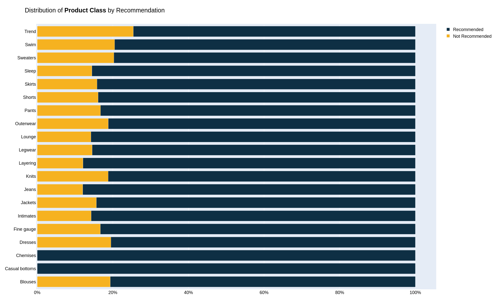

# Natural Language Processing Project

A brief description of what this project does and who it's for.

## Table of Contents

- [Installation](#installation)
- [Components](#Defining_NLP_components)
- [Training NLP Model](#Training_Model)
- [Training ANN Model](#ANN-model)
- [Tuning of Model](#CROSS_VALIDATION)
- [Comparison](#Comparison_with_other_Models)
- [Conclusion](#Conclusion)

## Installation

Instructions on how to install and set up the project.

```bash
pip install -r requirements.txt
```

## Defining NLP Components
>Text Preprocessing

Defining the steps for text preprocessing such as tokenization, stemming, and lemmatization.

>Feature Extraction

Defining the methods for feature extraction like TF-IDF, Word2Vec, and BERT embeddings.

## Training Model
>Combining Preprocessing and Feature Extraction

- In the build_nlp_pipeline function, combine preprocessing and feature extraction steps.

- Prepare the data for training and testing the model.

- After training the model, evaluate its performance on the test data.

## RNN_Model
>Training and Evaluation Steps

- **Data Preprocessing**: Normalize the input data and split it into training and testing sets.

- **Model Architecture**: Define the architecture of the Artificial Neural Network (ANN).
- **Compile Model**: Compile the model with appropriate loss function and optimizer.
- **Train Model**: Train the model using the training data.
- **Evaluate Model**: Evaluate the model using the testing data to determine its accuracy.

>Accuracy 

```python
Test set
  Loss: 0.365
  Accuracy: 0.856

```




## Conclusion

In conclusion, this project demonstrates the effectiveness of Natural Language Processing (NLP) techniques in text analysis and the potential of combining NLP-generated features with traditional models like Artificial Neural Networks (ANNs) to improve performance. The cross-validation results and comparison with other models highlight the robustness and accuracy of the proposed approach. Future work could explore further tuning of the NLP and ANN models, as well as the application of this methodology to other datasets and domains.

This project is licensed under the MIT License - see the [LICENSE](LICENSE) file for details.